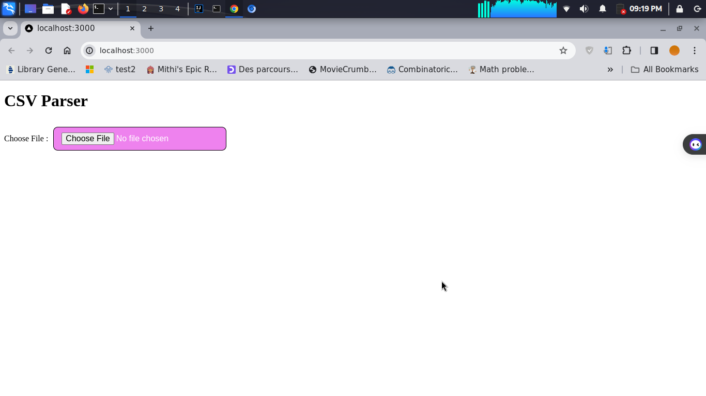
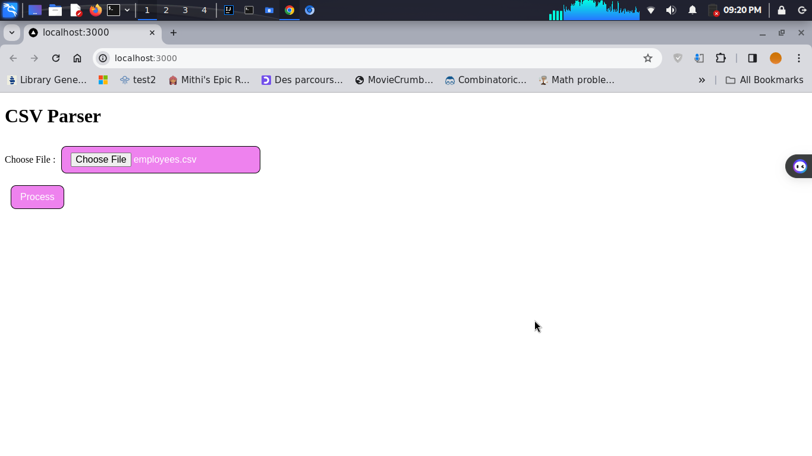
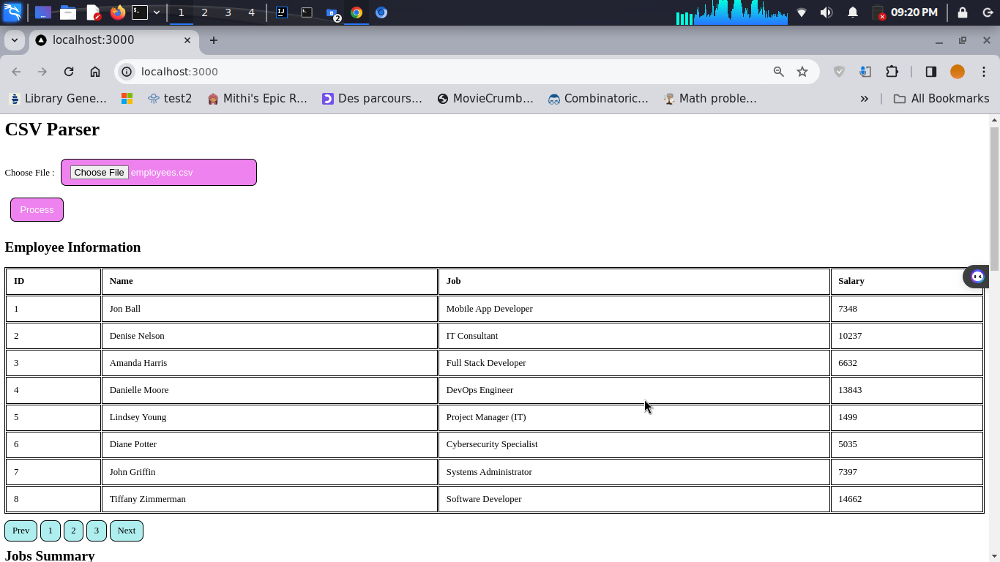
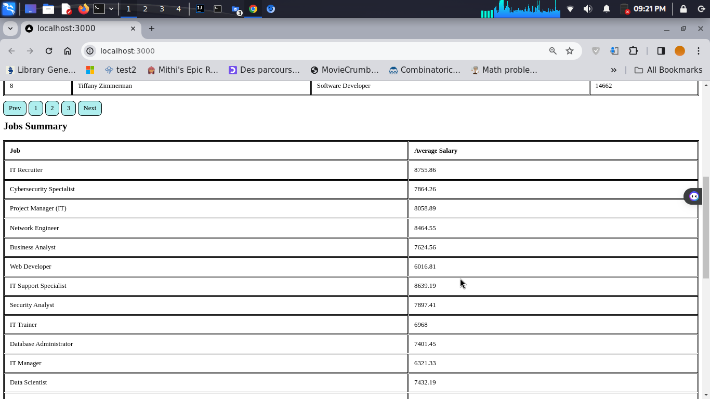

## DNA Engineering Full-Stack Assignment
Build a CSV Parser.

### Interface 1

The button for uploading a CSV file is displayed.




### Interface 2
Once you have selected the CSV file, the app will display a 'Process File' button.
See Interface 2 for a screenshot.



### Interface 3
After the file is processed by the service, the employee data and job details are displayed in a table format.

See Interface 3 for reference.




## How to Run the Project

### Frontend

To run the frontend, follow these steps:

1.


Navigate to the `frontend` folder.
2.

Run the following commands:

```bash
npm
   install
npm
   run dev
```


To start the frontend development server and install the required dependencies, follow these steps:


1. Run the command to navigate to the `backend` folder.
2. Run the following commands:
   ```bash mvn clean install```
   To clean the project, build
   it, and start the backend server using the generated JAR file, run the command 'java -jar target/backend-0.0.1-SNAPSHOT.jar'.
 